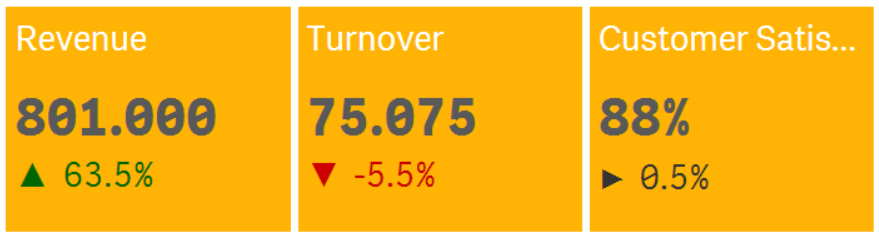

# Themable KPI Tile

> KPI Tile for Qlik Sense with the ability to use themes or to customize background color, comparison indicator, etc.

## Purpose and Description

I have created this visualization extension to make it easy to create themable KPI tiles without having to create a custom visualization extension all the time.

You can create your own themes by just modifying a simple .json file (see below for further explanation).

**Note:**

This extension has some _basic_ built-in logic to be responsive but is by far not that responsive as the native KPI object of Qlik Sense.

## Screenshots



## Installation

1. Download the [latest version](https://github.com/stefanwalther/qsThemableKpiTile/raw/master/build/swr-themablekpitile_latest.zip)
2. Qlik Sense Desktop
  - To install, copy all files in the .zip file to folder "C:\Users[%Username%]\Documents\Qlik\Sense\Extensions\ThemableKpiTile"
* Qlik Sense Server
  - See instructions [how to import an extension on Qlik Sense Server](http://help.qlik.com/sense/en-us/developer/#../Subsystems/Workbench/Content/BuildingExtensions/HowTos/deploy-extensions.htm)

## Configuration

You can use the following properties to define the behavior of this visualization extension:

### Data

For every _Themable KPI Tile_ the following options can be set:

* **`KPI title`** - The title of your KPI
* **`KPI`** - The KPI, any numeric or dual value
* **`KPI comparison (numeric value)`** - The numeric value which is relevant to render the positive, negative or neutral color & icon defined in the template.
* **`KPI comparison (displayed value)`** - Put the formatted comparison value here (use e.g. Qlik's `num` method).

[](http://help.qlik.com/sense/en-us/developer/#../Subsystems/Workbench/Content/BuildingExtensions/HowTos/deploy-extensions.htm)

### Appearance - Layout

Choose either the **`Default Layout`**, **`Custom Layout`** or choose one of the **`Templates`**.

You can add additional templates by modifying the `layouts.json` file, located under `./config/` by adding new layouts as follows:

```js
"orange": {
    "name": "Orange",
    "tileBackgroundColor": "#FFB304",
    "titleColor": "#fff",
    "comparisonPositiveColor": "#006600",
    "comparisonNegativeColor": "#CC0000",
    "comparisonNeutralColor": "#333",
    "comparisonPositiveIcon": "&#9650;",
    "comparisonNegativeIcon": "&#9660;",
    "comparisonNeutralIcon": "&#9654;"
  }
```

In case of choosing "Custom Layout" the following settings can be used:
* **`Title Background Color`** - Any valid [hex color](http://www.w3schools.com/tags/ref_colorpicker.asp)
* **`Title Color`** - Any valid [hex color](http://www.w3schools.com/tags/ref_colorpicker.asp)
* **`KPI Color`** - Any valid [hex color](http://www.w3schools.com/tags/ref_colorpicker.asp)
* **`Comparison Color`** - Any valid [hex color](http://www.w3schools.com/tags/ref_colorpicker.asp)

[](http://www.w3schools.com/tags/ref_colorpicker.asp)

## Contributing

Contributing to this project is welcome. The process to do so is outlined below:

1. Create a fork of the project
2. Work on whatever bug or feature you wish
3. Create a pull request (PR)

I cannot guarantee that I will merge all PRs but I will evaluate them all.

## Author

**Stefan Walther**

+ [qliksite.io](http://qliksite.io)
* [twitter/waltherstefan](http://twitter.com/waltherstefan)
* [github.com/stefanwalther](http://github.com/stefanwalther)

## License

Copyright © 2015 Stefan Walther
Released under the MIT license.

***

_This file was generated by [verb-cli](https://github.com/assemble/verb-cli) on July 06, 2015._